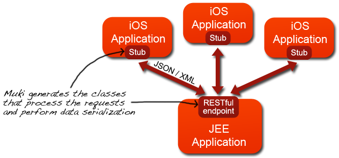
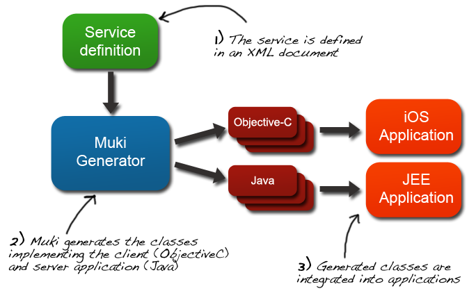
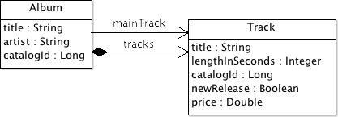
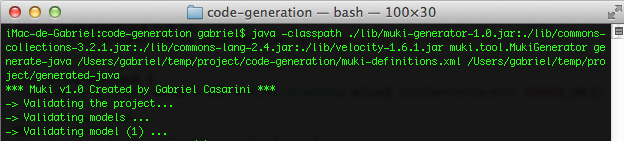
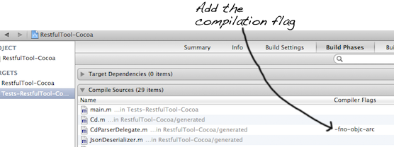

Index
======
1 - <a href="#description">What is Muki?</a> 
2 - <a href="#requirements">Requirements for using Muki</a> 
3 - <a href="#use">How do you use Muki?</a> 
4 - <a href="#definition">Defining a service</a> 
5 - <a href="#codeGeneration">Generating code</a> 
6 - <a href="#integration">Integrating generated code in the applications</a> 
7 - <a href="#example">A full example</a> 

1 - What is Muki?
=================
**Muki** is a tool for rapidly generating code that automates the communication between iOS clients and a JEE server application through RESTful services. Starting from the description of the service, Muki generates additional classes in Objective-C that can be easily integrated into iOS applications and Java classes that allow to quickly implement a RESTful service following the standard [JAX-RS](http://jax-rs-spec.java.net).
 
The entire HTTP communication process and data serialization and conversion between the server and client applications is done automatically by the generated classes.

So with Muki, applications written for iOS can easily connect with RESTful services implemented in Java. The generated code is 100% readable and clean. Muki generated classes abstract away the communication between clients and server and hide the details of the communication carried out in HTTP (GET, POST, PUT and DELETE methods) and the serialization of objects traveling in XML and JSON. The following code snippet shows the invocations performs by an iOS application to communicate with a remote server, using the classes generated by Muki.

    // Instantiate the proxy to access the service
    CustomerControllerStub  *service = [[CustomerControllerStub alloc] initControllerUrl: @"http://localhost:8080/demo-server/store"];
    
    // Send an object to server
    NSError *error;
    Customer *newCustomer = [[Customer alloc] init];
    newCustomer.name = @"Paul Smith";
    newCustomer.telephone = @"678 900 000";
    [service addCustomer:newCustomer error:&error];
    
    // Get a object from the server
    Customer *anotherCustomer = [service getCustomerId:@"12345667" error:&error];;

2 - Requirements for using Muki
=====================================
2.1 - Requirements to run the class generation process
------------------------------------------------------
*   **Java** installation (JRE 1.5+) 
*   [muki-generator-1.0.jar](https://github.com/97bytes/Muki/blob/master/bin-distribution/) (Muki distribution)
*   [commons-collections-3.2.1.jar](http://commons.apache.org/collections/), [commons-lang-2.4.jar](http://commons.apache.org/lang/), [velocity-1.6.1.jar](http://velocity.apache.org)
*   Note that other versions of the libraries might also work, but those are the versions that we used in our tests.

2.2 - iOS client requirements
-----------------------------
*   You need Xcode 4.5.x 

2.3 - JEE application requirements
----------------------------------
*   A framework that implements the [JAX-RS](http://jax-rs-spec.java.net) specification, like [RESTEasy](http://www.jboss.org/resteasy) or other
*   Optional: you can integrate the generated classes with [Spring Framework](http://www.springsource.org/spring-framework) or use any other framework. In our tests, we deployed the server on [Google App Engine](https://developers.google.com/appengine/) using RESTEasy v2.0.1 libraries and Spring.

3 - How do you use Muki?
========================
Creating a service with Muki is summarized in three steps:

**STEP 1:** Create the service definition using an XML document. The definition declares the operations exposed by the service and the data structures representing the parameters and resources.

**STEP 2:** Calling the code generation process from Java.

**STEP 3:** Integrating generated classes in your applications.

4 - Defining a service
======================
Creating RESTful services with Muki begins with a description of the data structures and operations for serving the requests sent by clients (iOS). The description of the service must be available in an XML document.

The service description has two parts: one is the definition of the **models**, which are data structures that represent the input and output parameters (resources), on the other hand are the **controllers** for processing the HTTP requests and serve the web service resources.

The following snippet shows the structure of a Muki service definition. The complete schema of the XML document is available in [muki-service-description-v01.xsd](resources/muki-service-description-v01.xsd).

	<ns2:project name="MukiDemo" xmlns:ns2="http://muki/service-description/">
	    <b><model-definitions ... ></b>
	        <model name="CustomerData">
	            ...
	        </model>
	        ...
	    <b></model-definitions></b>
	    <b><controller-definitions ... ></b>
	        <controller name="CustomerController" ... >
	            <get-operation ... />
	            <post-operation ... />
	            <put-operation ... />
	            <delete-operation ... />
	            ...
	        </controller>
	        ...
	    <b></controller-definitions></b>
	</ns2:project>

4.1 - Defining models to represent resources
--------------------------------------------
In Muki, a **model** is an object that represents the application data and is used to send and receive information between iOS clients and the server. A model can be seen as a class representing a web resource. With the description of the models, Muki generates classes that automate the process of serializing and deserializing objects in JSON and XML. Generated Java classes include JAXB annotations that handle the serialization. For the serialization of Objective-C classes, Muki generates support classes also in Objective-C.

The following snippet shows the definition of **models**:

    <model-definitions java-package="...">
        <model name="Model1">
            <simple-attr type="..." name="..." />
            <simple-attr type="..." name="..." />
            ...
        </model>
        <model name="Model2">
            <simple-attr type="..." name="..." />
            <list-attr items-type="Model1" name="items" />
            ...
        </model>
        ...
    </model-definitions>

The definitions of the models must be inside an **&lt;model-definitions java-package = " ... "&gt;** element. The value of **java-package** attribute is the name of the Java package where Muki generates the Java classes (beans). Each model is defined with a **&lt;model name = " ... "&gt;** element. The value of the **name** attribute is the name used to generate the corresponding class in Java and Objective-C. Each model has one or more attributes, which can be either simple or represent list types. Simple attributes can be basic types (boolean, integer, string, etc.) or references to other models. List attributes can only have references to other models, it is not possible to have lists of basic types.

The following table shows the basic types used by Muki and their correspondence with Java and Objective-C data types when generating classes.

<table>
    <tr>
        <th align="center"><b>Muki basic type</b></th>
        <th align="center"><b>Java type</b></th>
        <th align="center"><b>Objective-C type</b></th>
    </tr>
    <tr>
        <td align="center">STRING</td>
        <td align="center">String</td>
        <td align="center">NSString</td>
    </tr>
    <tr>
        <td align="center">LONG</td>
        <td align="center">long</td>
        <td align="center">long long</td>
    </tr>
    <tr>
        <td align="center">INT</td>
        <td align="center">int</td>
        <td align="center">NSInteger</td>
    </tr>
    <tr>
        <td align="center">DOUBLE</td>
        <td align="center">double</td>
        <td align="center">double</td>
    </tr>
    <tr>
        <td align="center">BOOLEAN</td>
        <td align="center">boolean</td>
        <td align="center">BOOL</td>
    </tr>
</table>

Take for example the following diagram with two *models*. There is a model called **TrackData** that has attributes of basic types (String, Long, Boolean, etc.) And there is a model called **AlbumData** having 2 attributes of type String, a reference to TrackData and an attribute that is a list of **TrackData**:

The following fragment corresponds to the description required by Muki to create classes in Java and Objective-C for the previous model:

    <model-definitions java-package="demo.model">
        <model name="TrackData">
            <simple-attr type="STRING" name="title" />
            <simple-attr type="INT" name="lengthInSeconds" />
            <simple-attr type="LONG" name="catalogId" />
            <simple-attr type="BOOLEAN" name="newRelease" />
            <simple-attr type="DOUBLE" name="price" />
        </model>
        <model name="AlbumData">
            <simple-attr type="LONG" name="catalogId" />
            <simple-attr type="STRING" name="title" />
            <simple-attr type="STRING" name="artist" />
            <simple-attr type="TrackData" name="mainTrack" />
            <list-attr items-type="TrackData" name="tracks" />
        </model>
    </model-definitions>

With the above definition, Muki generates the following classes in Java. The classes have JAXB annotations for XML and JSON serialization:

	@XmlRootElement(name = "trackdata")
	@XmlType(name = "TrackData", propOrder = {})
	public class TrackData implements Serializable {
	    private static final long serialVersionUID = 1L;
	    private String title;
	    private int lengthInSeconds;
	    private long catalogId;
	    private boolean newRelease;
	    private double price;

	    @XmlElement(name = "title")
	    public String getTitle() {
	        return this.title;  
	    }
	 
	    public void setTitle(String newValue) {
	        this.title = newValue;  
	    }
	            
	    @XmlAttribute(name = "price")
	    public double getPrice() {
	        return this.price;  
	    }

	    ...
	}

And also:

	@XmlRootElement(name = "albumdata")
	@XmlType(name = "AlbumData", propOrder = {})
	public class AlbumData implements Serializable {
	    private static final long serialVersionUID = 1L;
	    private long catalogId;
	    private String title;
	    private String artist;
	    private TrackData mainTrack;
	    private List<TrackData> tracks = new ArrayList<TrackData>();

	    @XmlElement(name = "title")
	    public String getTitle() {
	        return this.title;  
	    }
	 
	    @XmlElement(name = "mainTrack")
	    public TrackData getMainTrack() {
	        return this.mainTrack;  
	    }
	 
	    public void setMainTrack(TrackData newValue) {
	        this.mainTrack = newValue;  
	    }
	    
	    @XmlElementWrapper(name = "tracks")
	    @XmlElement(name = "trackdata")
	    public List<TrackData> getTracks() {
	        return this.tracks;  
	    }
	 
	    public void addToTracks(TrackData aValue) {
	        this.tracks .add(aValue);   
	    }
	    
	    public void removeFromTracks(TrackData aValue) {
	        this.tracks .remove(aValue);   
	    }

	    ...
	}

With the above definition, Muki generates the following classes in Objective-C. Note that unlike Java, Objective-C classes have no annotations and the whole process of XML and JSON serialization is performed by auxiliary classes.

	@interface TrackData : NSObject {
	    NSString *title;
	    NSInteger lengthInSeconds;
	    long long catalogId;
	    BOOL newRelease;
	    double price;
	}
	    @property (nonatomic, strong) NSString *title;
	    @property NSInteger lengthInSeconds;
	    @property long long catalogId;
	    @property BOOL newRelease;
	    @property double price;
	    - (id)init;
	@end

And also:

	@interface AlbumData : NSObject {
	    long long catalogId;
	    NSString *title;
	    NSString *artist;
	    TrackData *mainTrack;
	    NSMutableArray *tracks;
	}
	    @property long long catalogId;
	    @property (nonatomic, strong) NSString *title;
	    @property (nonatomic, strong) NSString *artist;
	    @property (nonatomic, strong) TrackData *mainTrack;
	    @property (nonatomic, strong) NSMutableArray *tracks;
	    - (id)init;
	    - (void)addToTracks: (TrackData *)anObject;
	    - (void)removeFromTracks: (TrackData *)anObject;
	@end

4.2 - Defining controllers with the service operations
------------------------------------------------------
The **controllers** described the service operations that deal with incoming requests to get, add, update and delete server web resources. With the definition of the controllers, Muki generates classes that simplify the communication between iOS clients and the server. Thus, the remote communication becomes simple method invocations between objects. The generated classes are responsible for establishing the communication between iOS clients and the server following RESTful principles by using the following HTTP methods: **GET**, **POST**, **PUT** and **DELETE**.

The following snippet shows the definition of the controllers:

    <controller-definitions java-package="...">
        <controller http-path="..." name="Controller1" >
            <get-operation http-path="..." return-type="..." name="..." serialization-type="...">
                <path-param name="..." />
            </get-operation>
            ...
            <post-operation serialization-type="..." http-path="..." param-type="..." return-type="..." name="..." />
            <put-operation serialization-type="..." http-path="..." param-type="..." name="..." />
            <delete-operation http-path="..." name="...">
                <path-param name="..." />
            </delete-operation>
        </controller>
        <controller http-path="..." name="Controller2" >
            ...
        </controller>
    </controller-definitions>

As our goal is to create a RESTful service, the service operations are mapped directly to HTTP methods invocations. So, to send invocations from iOS, Muki uses the definition of the controllers to generate stubs that prepare and send HTTP invocations. To process the requests on the JEE server, Muki uses the definition of the controllers to create classes with annotations that follow the [JAX-RS](http://jax-rs-spec.java.net">JAX-RS) specification.

4.2.1 - GET Operations
-----------------------
GET operations return resources. The following snippet shows all attributes and sub​​-elements to define a GET operation with Muki.

    <get-operation http-path="/customers/{customerId}/{orderId}" return-type="OrderData" name="getOrder" serialization-type="json">
        <path-param name="customerId" />
        <path-param name="orderId" />
    </get-operation>

The following table summarizes all the attributes to define a GET operation with Muki:

<table>
    <tr>
        <th align="center"><b>Attributes</b></th>
        <th align="center"><b>Comments</b></th>
    </tr>
    <tr>
        <td align="center">name</td>
        <td>This is the name of the operation and must be unique. In Java, this value is used to name of the corresponding method in the controller. In Objective-C it is used as the first keyword of the method defined in the stub.</td>
    </tr>
    <tr>
        <td align="center">http-path</td>
        <td>The path to invoke the operation. It can be an expression formed with parameters. For example: "/customers/{id}/{orderId}". If the path contains parameters, you must declare them with sub-elements &lt;path-param ... /&gt; and &lt;query-param ... /&gt;.</td> 
    </tr>
    <tr>
        <td align="center">return-type</td>
        <td>It's the result type. The value can be STRING or the name of a model.</td>
    </tr>
    <tr>
        <td align="center">serialization-type</td>
        <td>It takes the value "json" or "xml". It indicates the format to serialize the resource (model) returned by the operation. Required if the value of return-type is the name of a model.</td>
    </tr>
</table>

The value of **http-path** may include parameters **{param}** to make the URI used to invoke the operation more flexible. If parameters are included, you need to add sub​​-elements &lt;path-param name="param1" /&gt; and &lt;query-param name="param2" /&gt; so that Muki can build the methods correctly. The names of the parameters that appear in http-path must match the names declared in the sub-elements.

Take for example the following definition of an operation:

    <get-operation http-path="/customers/{customerId}/{orderId}" return-type="OrderData" name="getOrder" serialization-type="json">
        <path-param name="customerId" />
        <path-param name="orderId" />
    </get-operation>

With the above definition, Muki generates the following Java method in the controller:

    @GET
    @Path("/customers/{customerId}/{orderId}")
    @Produces("application/json")
    public OrderData getOrder(@PathParam("customerId") String customerId, @PathParam("orderId") String orderId) {
        OrderData result = this.getDelegate().getOrder(customerId, orderId);
        ...
    }

In the stub interface in Objective-C, Muki declares the following method:

	- (OrderData*)getOrderCustomerId: (NSString *)aString1 orderId: (NSString *)aString2 error: (NSError **)error;    

4.2.2 - POST and PUT operations
------------------------------
In general, POST operations are used to add new resources and PUT operations to update the properties of existing resources on the server. The following snippet shows all attributes and sub​​-elements to define POST and PUT operations in Muki. Its structure is similar.

    <post-operation http-path="/customers/{customerId}/{orderId}" param-type="OrderData" return-type="OrderData" name="addOrder" serialization-type="json">
        <path-param name="customerId" />
        <path-param name="orderId" />
    </post-operation>

    <put-operation http-path="/customers/{customerId}/{orderId}" param-type="OrderData" return-type="OrderData" name="updateOrder" serialization-type="json">
        <path-param name="customerId" />
        <path-param name="orderId" />
    </put-operation>

The following table summarizes all the attributes to define POST / PUT operations with Muki:

<table>
    <tr>
        <th align="center"><b>Attributes</b></th>
        <th align="center"><b>Comments</b></th>
    </tr>
    <tr>
        <td align="center">name</td>
        <td>This is the name of the operation and must be unique. In Java, this value is used to name of the corresponding method in the controller. In Objective-C it is used as the first keyword of the method defined in the stub.</td>
    </tr>
    <tr>
        <td align="center">http-path</td>
        <td>The path to invoke the operation. It can be an expression formed with parameters. For example: "/customers/{id}/{orderId}". If the path contains parameters, you must declare them with sub-elements &lt;path-param ... /&gt; and &lt;query-param ... /&gt;.</td> 
    </tr>
    <tr>
        <td align="center">param-type</td>
        <td>PUT and POST operations can send an object (model) as a parameter. The param-value type indicates the type of the parameter and can be STRING or the name of a model. If this attribute is not set, it means that the operation has no input parameter.</td>
    </tr>
    <tr>
        <td align="center">return-type</td>
        <td>It the result type. The value can be STRING or the name of a model.</td>
    </tr>
    <tr>
        <td align="center">serialization-type</td>
        <td>It takes the value "json" or "xml". It indicates the format to serialize the resource (model) returned by the operation. Required if the value of return-type is the name of a model.</td>
    </tr>
</table>

The value of **http-path** may include parameters **{param}** to make the URI used to invoke the operation more flexible. See the explanation in the GET operations section.

Take for example the following definition of a POST operation and another PUT:

	<post-operation http-path="/customers/{customerId}/{orderId}" param-type="OrderData" return-type="OrderData" name="addOrder" serialization-type="json">
        <path-param name="customerId" />
        <path-param name="orderId" />
	</post-operation>

    <put-operation http-path="/customers/{customerId}/{orderId}" param-type="OrderData" return-type="OrderData" name="updateOrder" serialization-type="json">
        <path-param name="customerId" />
        <path-param name="orderId" />
    </put-operation>

With the above definition, Muki generates the following Java methods in the controller:

    @POST
    @Path("/customers/{customerId}/{orderId}")
    @Consumes("application/json")
    @Produces("application/json")
    public OrderData addOrder(@PathParam("customerId") String customerId, @PathParam("orderId") String orderId, OrderData param) {
        return this.getDelegate().addOrder(customerId, orderId, param);
    }

    @PUT
    @Path("/customers/{customerId}/{orderId}")
    @Consumes("application/json")
    @Produces("application/json")
    public OrderData updateOrder(@PathParam("customerId") String customerId, @PathParam("orderId") String orderId, OrderData param) {
        return this.getDelegate().updateOrder(customerId, orderId, param);
    }

In the stub interface in Objective-C, Muki declares the following methods:

	- (OrderData*)addOrder: (OrderData *)anObject customerId: (NSString *)aString2 orderId: (NSString *)aString3 error: (NSError **)error;    
	- (OrderData*)updateOrder: (OrderData *)anObject customerId: (NSString *)aString2 orderId: (NSString *)aString3 error: (NSError **)error;    

4.2.3 - DELETE operations
-------------------------
DELETE operations remove resources from the server. The following snippet shows all attributes and sub​​-elements to define DELETE operations with Muki:

    <delete-operation http-path="/customers/{customerId}/{orderId}" name="deleteOrder">
        <path-param name="customerId" />
        <path-param name="orderId" />
    </delete-operation>

The following table summarizes all the attributes to define a DELETE operation with Muki:

<table>
    <tr>
        <th align="center"><b>Attributes</b></th>
        <th align="center"><b>Comments</b></th>
    </tr>
    <tr>
        <td align="center">name</td>
        <td>This is the name of the operation and must be unique. In Java, this value is used to name of the corresponding method in the controller. In Objective-C it is used as the first keyword of the method defined in the stub.</td>
    </tr>
    <tr>
        <td align="center">http-path</td>
        <td>The path to invoke the operation. It can be an expression formed with parameters. For example: "/customers/{id}/{orderId}". If the path contains parameters, you must declare them with sub-elements &lt;path-param ... /&gt; and &lt;query-param ... /&gt;.</td> 
    </tr>
</table>

The value of **http-path** may include parameters **{param}** to make the URI used to invoke the operation more flexible. See the explanation in the GET operations section.

Take for example the following definition of a DELETE operation:

    <delete-operation http-path="/customers/{customerId}/{orderId}" name="deleteOrder">
        <path-param name="customerId" />
        <path-param name="orderId" />
    </delete-operation>

With the above definition, Muki generates the following Java method in the controller:

    @DELETE
    @Path("/customers/{customerId}/{orderId}")
    public void deleteOrder(@PathParam("customerId") String customerId, @PathParam("orderId") String orderId) {
        this.getDelegate().deleteOrder(customerId, orderId);
    }

In the stub interface in Objective-C, Muki declare the following method:

	- (void)deleteOrderCustomerId: (NSString *)aString1 orderId: (NSString *)aString2 error: (NSError **)error;    

5 - Generating code
===================
Once the service description is finished, you run the code generation process. This is a program written in Java that is invoked from the command-line interface or by using an Ant script. In both cases, in addition to the Muki library ([muki-generator-1.0.jar](https://github.com/97bytes/Muki/blob/master/bin-distribution/)), you must add the following libraries to the classpath: **commons-collections-3.2.1.jar**, **commons-lang-2.4.jar**, **velocity-1.6.1.jar**. Note that other versions of the libraries might also work.

Indeed, you must do two invocations of the process: one to generate Java classes and the another to generate Objective-C classes.

When you invoke the code generation process, Muki first evaluates the service definition (XML). If the definition has no errors, Muki generates the classes in the output directory. If the definition has errors, Muki lists the problems encountered. In this case, you must fix the issues and re-invoke the code generation process.

5.1 - Command-line interface
----------------------------
Command syntax: **muki.tool.MukiGenerator &lt;option&gt; &lt;path-to-definition.xml&gt; &lt;output-directory&gt;**

where:

*    **&lt;option&gt;**:  must be **generate-java** or **generate-objc**, to indicate whether Muki generates Java server classes or the classes for the iOS Cocoa client, respectively.
*    **&lt;path-to-definition.xml&gt;**: the full path to the XML file that has the service definition
*    **&lt;output-directory&gt;**: full path to the directory where Muki generates the classes. The directory must exist.

Example of an invocation to generate Java classes:

	>java -classpath ./lib/muki-generator-1.0.jar:./lib/commons-collections-3.2.1.jar:./lib/commons-lang-2.4.jar:./lib/velocity-1.6.1.jar muki.tool.MukiGenerator generate-java /Users/gabriel/temp/project/code-generation/muki-definitions.xml /Users/gabriel/temp/project/generated-java

5.2 - Using an Ant script
-------------------------

    <target name="generate-java-server">
      <path id="tools.classpath">
        <fileset dir="${basedir}/lib">
          <include name="*.jar" />
        </fileset>
      </path>
      <taskdef name="muki-generator" classpathref="tools.classpath" classname="muki.tool.AntTask"/>
      <mkdir dir="${server.generation.dir}"/>
      <muki-generator 
        option="generate-java" 
        projectFile="${basedir}/muki-definitions.xml" 
        outputDirectory="${server.generation.dir}" />
    </target>

6 - Integrating generated code in the applications
==================================================
**Important notice: none of the classes generated by Muki should be modified manually. If changes are required, you must change the service definition (XML) and re-launch the code generation process.**

The following diagram shows the sequence of invocations for getting server resources. The iOS application invokes a method in the stub generated by Muki (Objective-C). The stub is responsible for processing the call and sending the HTTP request (GET) to the server. The HTTP request arrives at the server, it is processed and becomes the method invocation of the controller class generated by Muki (Java). The controller in turn invokes the delegate that implements the functionality of the service. The delegate implements a Java interface also generated by Muki.

6.1 - Code generated for integrating in the JEE application (server)
--------------------------------------------------------------------
The following table summarizes the classes generated by Muki for the Java application (server), when invoking the process with the option: <code>**generate-java**</code>:

<table>
    <tr>
        <th align="center"><b>Class / Interface</b></th>
        <th align="center"><b>Comments</b></th>
    </tr>
    <tr>
        <td align="center">RestApplication</td>
        <td>This is the class that manages JAX-RS integration. Returns the instance of the service that will listen for requests. This class should not be modified manually!</td>
    </tr>
    <tr>
        <td align="center">Model</td>
        <td>For each <b>&lt;model ... &gt;</b> definition, Muki generates a class with JAXB annotations for the serialization in XML and JSON. These classes are the beans that travel between the iOS clients and the server. These classes should not be changed manually!</td> 
    </tr>
    <tr>
        <td align="center">Controllers</td>
        <td>For each <b>&lt;controller ... &gt;</b> definition, Muki generates a class with JAX-RS annotations. These controllers receive and process HTTP requests sent by clients. The controllers have methods for the operations declared in: <b>&lt;get-operation ... &gt;</b>, <b>&lt;post-operation ... &gt;</b>, <b>&lt;put-operation ... &gt;</b> and <b>&lt;delete-operation ... &gt;</b>. The controllers invoke other classes called <b>Delegates</b>. That's where you implement the service logic. The controllers classes must not be changed manually!</td> 
    </tr>
    <tr>
        <td align="center">ControllerDelegates</td>
        <td>These interfaces declare all the operations of the service controllers. The developer must implement these interfaces with the concrete behavior of the service and also integrate the Delegates in the controllers. When a request comes to a controller, it invokes the delegate that it is associated with. Muki generates a delegate interface for each controller. The definition of Delegates should not be changed manually!</td> 
    </tr>
    <tr>
        <td align="center">MukiExceptionMapper</td>
        <td>This is a support class that implements a mapper that handles the exceptions that are thrown when a resource is not found on the server. This class should not be changed manually!</td> 
    </tr>
    <tr>
        <td align="center">MukiResourceNotFoundException</td>
        <td>It is a support class to represent exceptions that are thrown when a resource is not found on the server. This class should not be changed manually!</td> 
    </tr>
</table>

6.2 - Code generated for iOS (service clients)
----------------------------------------------
The following table summarizes the classes generated by Muki for the iOS application (client), when invoking the process with the option:<code>**generate-objc**</code>:

<table>
    <tr>
        <th align="center"><b>Class / Interface</b></th>
        <th align="center"><b>Comments</b></th>
    </tr>
    <tr>
        <td align="center">Model</td>
        <td>For each definition of <b>&lt;model ... &gt;</b>, Muki generates a class representing the resources and objects traveling between the iOS clients and the server. These objects are serialized in XML and JSON.</td>
    </tr>
    <tr>
        <td align="center">Model parser delegates</td>
        <td>Helper classes that handle XML serialization. It generates a delegate for each model. These classes implement the <a href="http://developer.apple.com/library/ios/#documentation/cocoa/reference/NSXMLParserDelegate_Protocol/Reference/Reference.html">NSXMLParserDelegate</a> protocol</td>
    </tr>
    <tr>
        <td align="center">MukiControllerStub</td>
        <td>It is the superclass of all stubs and implements the functionality to communicate with the remote server</td>
    </tr>
    <tr>
        <td align="center">Controller Stubs</td>
        <td>They represent the controllers on iOS client side. Client applications invoke operations on the stubs and the stubs encode and send HTTP requests to the server controllers. Muki creates a stub for each server controller</td>
    </tr>
    <tr>
        <td align="center">XmlSerializer XmlAttribute ObjectParserDelegate</td>
        <td>Helper classes used to serialize in XML</td>
    </tr>
    <tr>
        <td align="center">JsonSerializer  JsonDeserializer</td>
        <td>To handle the serialization from JSON. Framework is based on the <a href="http://stig.github.com/json-framework/">SBJson</a> framework</td>
    </tr>
    <tr>
        <td align="center">NSDataBase64</td>
        <td>Implements an extension to NSData allowing Base64 encoding and decoding. The original implementation was made by <a href="http://cocoawithlove.com/2009/06/base64-encoding-options-on-mac-and.html">Matt Gallagher (Cocoa with love)</a></td>
    </tr>
    <tr>
        <td align="center">SBJson classes</td>
        <td>Source code of the <a href="http://stig.github.com/json-framework/">SBJson</a> framework</td>
    </tr>
</table>

6.3 - Steps to integrate the generated classes in the client application (iOS)
------------------------------------------------------------------------------
Generally speaking, all generated classes are compatible with the [ARC (Automatic Reference Counting)](http://developer.apple.com/library/ios/#releasenotes/ObjectiveC/RN-TransitioningToARC/Introduction/Introduction.html) memory management scheme. The only exception to this, are <b>*ParserDelegate.m</b> classes that do not support ARC and use the conventional model and include [... autorelease].

This means it is necessary to make some manual adjustments. To integrate the classes generated by Muki, do the following:

**STEP 1)** In the application project (Xcode), use the ARC memory management model

**PASO 2)** Add all generated classes in the project, with the option **Add Files to ...**

**PASO 3)** Indicate that generated classes named like <b>ParserDelegate.m</b> do not use ARC (eg CdParserDelegate.m). To do so, go to the target of the project, go to the **Build phase** options and add a compilation flag: <code>-fno-objc-arc</code>

**PASO 4)** Compile. No compilation errors should appear.

**PASO 5)** In the application code, instantiate stubs and models and to make the service invocations. For example:

    TrackData *newTrack = [[TrackData alloc] init];
    newTrack.title = @"New track";
    newTrack.lengthInSeconds = 247;
    newTrack.price = 1.25;
    newTrack.newRelease = YES;
    newTrack.catalogId = 0;
    
    TrackControllerStub  *stub = [[TrackControllerStub alloc] initControllerUrl: @"http://localhost:8080/demo-server/store"];
    NSError *error;
    TrackData *addedTrack = [stub addTrack:newTrack error:&error];

    TrackData *myTrack = [stub getTrackId:@"3" error:&error];

Note that <b>*error</b> is an output parameter sent by reference so we can see if an error occurred during the remote server invocation. This is the correct way to handle errors in Cocoa. [See more details](https://developer.apple.com/library/mac/#documentation/Cocoa/Conceptual/ErrorHandlingCocoa/CreateCustomizeNSError/CreateCustomizeNSError.html").

6.4 - Steps to integrate the generated classes in the server application  (JEE)
-------------------------------------------------------------------------------

**STEP 1)** Add the libraries of a framework that implements the specification [JAX-RS](http://jax-rs-spec.java.net), like [RESTEasy](http://www.jboss.org/resteasy) or other

**STEP 2)** Add the Java classes generated by Muki

**STEP 3)** Create the classes that implement the <b>*Delegate</b> interfaces. These interfaces contain all the methods of controllers generated by Muki

**STEP 4)** Integrate the classes that implement the <b>*Delegate</b> interfaces with the controllers. This can be done by directly instantiating the classes in the controllers, but you may use the [Spring Framework](http://www.springsource.org/spring-framework) and its [dependency injection mechanism](http://static.springsource.org/spring/docs/3.2.x/spring-framework-reference/html/beans.html)

**STEP 5)** Declare the full name of the class **MukiExceptionMapper** as a parameter in the **web.xml** configuration file of the application. The name of the parameter depends on the implementation of JAX-RS you use. The following is the declaration required by Resteasy:

	<context-param>
	   <param-name>resteasy.providers</param-name>
	   <param-value>package.name.MukiExceptionMapper</param-value>        
	</context-param>

7 - A full example
==================
We provide a complete demo that shows how Muki generates the classes for an iOS client that connects to a RESTful service implemented in JEE.

The service implemented in the example uses the [Resteasy](http://www.jboss.org/resteasy/) implementation of JAX-RS and it also uses [Spring Framework](http://www.springsource.org/spring-framework) for inyecting dependencies.

To run the demo: download the [Muki_demo.zip](https://github.com/97bytes/Muki/tree/master/example) file, unzip it and follow the instructions available in the **instructions_en.html** file. All the necessary libraries are included, so you can have the example up and running quickly.

