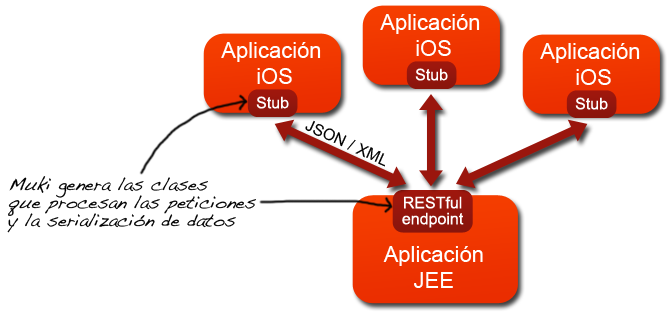

Index
======
1 - <a href="#description">What is Muki?</a> 
2 - <a href="#requirements">Requirements for using Muki</a> 
3 - <a href="#use">How do you use Muki?</a> 
4 - <a href="#definition">Defining a service</a> 
5 - <a href="#codeGeneration">Generating code</a> 
6 - <a href="#integration">Integrating generated code in the application</a> 
7 - <a href="#example">A full example</a> 

1 - What is Muki?
================
**Muki** is a tool for rapidly generating code that automates the communication between iOS clients and a JEE server application through RESTful services. Starting from the description of the service, Muki generates additional classes in Objective-C that can be easily integrated into iOS applications and Java classes that allow to quickly implement a RESTful service following the standard [JAX-RS](http://jax-rs-spec.java.net).

The entire HTTP communication process and data serialization and conversion between the server and client applications is done automatically by the generated classes.

So with Muki, applications written for iOS can easily connect with RESTful services implemented in Java. The generated code is 100% readable and clean. Muki generated classes abstract the communication between clients and server and hide the details of the communication carried out in HTTP (methods GET, POST, PUT and DELETE) and the serialization of objects traveling in XML and JSON. The following code snippet shows the invocations that an iOS application performs to communicate with a remote server, using the classes generated by Muki.

    // Instantiate the proxy to access the service
    CustomerControllerStub  *service = [[CustomerControllerStub alloc] initControllerUrl: @"http://localhost:8080/demo-server/store"];
    
    // Send an object to server
    NSError *error;
    Customer *newCustomer = [[Customer alloc] init];
    newCustomer.name = @"Paul Smith";
    newCustomer.telephone = @"678 900 000";
    [service addCustomer:newCustomer error:&error];
    
    // Get a object from the server
    Customer *anotherCustomer = [service getCustomerId:@"12345667" error:&error];;

2 - Requirements for using Muki
=====================================
2.1 - Requirements to run the class generation process
------------------------------------------------------
*   **Java** installation (JRE 1.5+) 
*   muki-generator-1.0.jar
*   [commons-collections-3.2.1.jar](http://commons.apache.org/collections/), [commons-lang-2.4.jar](http://commons.apache.org/lang/), [velocity-1.6.1.jar](http://velocity.apache.org)
*   Note that other versions of the libraries might also work, but those are the versions that we used in our tests.

2.2 - iOS client requirements
-----------------------------
*   You need Xcode 4.5.x 

2.3 - JEE application requirements
----------------------------------
*   A framework that implements the specification [JAX-RS](http://jax-rs-spec.java.net), like [RESTEasy](http://www.jboss.org/resteasy) and others</li>
*   Optional: you can integrate the generated classes with [Spring Framework](http://www.springsource.org/spring-framework) and any framework. In our tests, we deployed the server on [Google App Engine](https://developers.google.com/appengine/) using RESTEasy v2.0.1 libraries.

3 - How do you use Muki?
========================
Creating a service with Muki is summarized in three steps:
**STEP 1:** Create the service definition using an XML document. The definition declares the operations exposed by the service and the data structures representing the parameters and resources.
** STEP 2:** Calling the build process from Java.
** STEP 3:** Integrating generated classes in your applications.

4 - Defining a service
======================
Creating RESTful services with Muki begins with a description of the data structures and operations for serving the requests sent by clients (iOS). The description of the service must be available in an XML document.

The service description has two parts: one is the definition of the **models**, which are data structures that represent the input and output parameters (resources), on the other hand are the **controllers** for processing the HTTP requests and serve the web service resources.

The following snippet shows the structure of a Muki service definition. The complete schema of the XML document is available in [muki-service-description-v01.xsd](muki-service-description-v01.xsd).

	<ns2:project name="MukiDemo" xmlns:ns2="http://muki/service-description/">
	    <b><model-definitions ... ></b>
	        <model name="CustomerData">
	            ...
	        </model>
	        ...
	    <b></model-definitions></b>
	    <b><controller-definitions ... ></b>
	        <controller name="CustomerController" ... >
	            <get-operation ... />
	            <post-operation ... />
	            <put-operation ... />
	            <delete-operation ... />
	            ...
	        </controller>
	        ...
	    <b></controller-definitions></b>
	</ns2:project>

4.1 - Defining models to represent resources
--------------------------------------------
In Muki, a **model** is an object that represents the application data and is used to send and receive information between iOS clients and the server. A model can be seen as a class representing a web resource. With the description of the models, Muki generates classes that automate the process of serializing and deserializing objects in JSON and XML. Generated Java classes include JAXB annotations that handle the serialization. For the serialization of Objective-C classes, Muki generates support classes also in Objective-C.

The following snippet shows the definition of **models**:

    <model-definitions java-package="...">
        <model name="Model1">
            <simple-attr type="..." name="..." />
            <simple-attr type="..." name="..." />
            ...
        </model>
        <model name="Model2">
            <simple-attr type="..." name="..." />
            <list-attr items-type="Model1" name="items" />
            ...
        </model>
        ...
    </model-definitions>

The definitions of the models must be within an element <model-definitions java-package = "... ">. The attribute value is the java-package package name where generated Java classes (beans). Each model is defined with a <model element name = "... ">. The value of the attribute "name" is the name used to generate the corresponding class in Java and Objective-C.  Attributes can be simple types (boolean, integer, string, etc.) or references to other models. The attributes for lists can only have references to other models, it is not possible to have lists of basic types.

The definitions of the models must be inside an **&lt;model-definitions java-package = " ... "&gt;** element. The value of **java-package** attribute is the name of the Java package where Muki generates the Java classes (beans). Cada model se define con un elemento **&lt;model name = " ... "&gt;**. The value of the **name** attribute is the name used to generate the corresponding class in Java and Objective-C. Each model has one or more attributes, which can be either simple or represent list types. Simple attributes can be basic types (boolean, integer, string, etc.) or references to other models. List attributes can only have references to other models, it is not possible to have lists of basic types.

The following table shows the basic types used by Muki and their correspondence with Java and Objective-C types when generating classes.

<table>
    <tr>
        <th align="center"><b>Muki basic type</b></th>
        <th align="center"><b>Java type</b></th>
        <th align="center"><b>Objective-C type</b></th>
    </tr>
    <tr>
        <td align="center">STRING</td>
        <td align="center">String</td>
        <td align="center">NSString</td>
    </tr>
    <tr>
        <td align="center">LONG</td>
        <td align="center">long</td>
        <td align="center">long long</td>
    </tr>
    <tr>
        <td align="center">INT</td>
        <td align="center">int</td>
        <td align="center">NSInteger</td>
    </tr>
    <tr>
        <td align="center">DOUBLE</td>
        <td align="center">double</td>
        <td align="center">double</td>
    </tr>
    <tr>
        <td align="center">BOOLEAN</td>
        <td align="center">boolean</td>
        <td align="center">BOOL</td>
    </tr>
</table>

Take for example the following diagram with two *models*. There is a model called **TrackData** that has attributes of basic types (String, Long, Boolean, etc.) And there is a model called **AlbumData** having 2 attributes of type String, a reference to TrackData and an attribute that is a list of **TrackData**:

The following fragment corresponds to the description required by Muki to create classes in Java and Objective-C for the previous model:

    <model-definitions java-package="demo.model">
        <model name="TrackData">
            <simple-attr type="STRING" name="title" />
            <simple-attr type="INT" name="lengthInSeconds" />
            <simple-attr type="LONG" name="catalogId" />
            <simple-attr type="BOOLEAN" name="newRelease" />
            <simple-attr type="DOUBLE" name="price" />
        </model>
        <model name="AlbumData">
            <simple-attr type="LONG" name="catalogId" />
            <simple-attr type="STRING" name="title" />
            <simple-attr type="STRING" name="artist" />
            <simple-attr type="TrackData" name="mainTrack" />
            <list-attr items-type="TrackData" name="tracks" />
        </model>
    </model-definitions>

With the above definition, Muki generates the following classes in Java. The classes have JAXB annotations for XML and JSON serialization:

	@XmlRootElement(name = "trackdata")
	@XmlType(name = "TrackData", propOrder = {})
	public class TrackData implements Serializable {
	    private static final long serialVersionUID = 1L;
	    private String title;
	    private int lengthInSeconds;
	    private long catalogId;
	    private boolean newRelease;
	    private double price;

	    @XmlElement(name = "title")
	    public String getTitle() {
	        return this.title;  
	    }
	 
	    public void setTitle(String newValue) {
	        this.title = newValue;  
	    }
	            
	    @XmlAttribute(name = "price")
	    public double getPrice() {
	        return this.price;  
	    }

	    ...
	}

And also:

	@XmlRootElement(name = "albumdata")
	@XmlType(name = "AlbumData", propOrder = {})
	public class AlbumData implements Serializable {
	    private static final long serialVersionUID = 1L;
	    private long catalogId;
	    private String title;
	    private String artist;
	    private TrackData mainTrack;
	    private List<TrackData> tracks = new ArrayList<TrackData>();

	    @XmlElement(name = "title")
	    public String getTitle() {
	        return this.title;  
	    }
	 
	    @XmlElement(name = "mainTrack")
	    public TrackData getMainTrack() {
	        return this.mainTrack;  
	    }
	 
	    public void setMainTrack(TrackData newValue) {
	        this.mainTrack = newValue;  
	    }
	    
	    @XmlElementWrapper(name = "tracks")
	    @XmlElement(name = "trackdata")
	    public List<TrackData> getTracks() {
	        return this.tracks;  
	    }
	 
	    public void addToTracks(TrackData aValue) {
	        this.tracks .add(aValue);   
	    }
	    
	    public void removeFromTracks(TrackData aValue) {
	        this.tracks .remove(aValue);   
	    }

	    ...
	}

With the above definition, Muki generates the following classes in Objective-C. Note that unlike Java, Objective-C classes have no annotations and the whole process of XML and JSON serialization is performed by auxiliary classes.

	@interface TrackData : NSObject {
	    NSString *title;
	    NSInteger lengthInSeconds;
	    long long catalogId;
	    BOOL newRelease;
	    double price;
	}
	    @property (nonatomic, strong) NSString *title;
	    @property NSInteger lengthInSeconds;
	    @property long long catalogId;
	    @property BOOL newRelease;
	    @property double price;
	    - (id)init;
	@end

And also:

	@interface AlbumData : NSObject {
	    long long catalogId;
	    NSString *title;
	    NSString *artist;
	    TrackData *mainTrack;
	    NSMutableArray *tracks;
	}
	    @property long long catalogId;
	    @property (nonatomic, strong) NSString *title;
	    @property (nonatomic, strong) NSString *artist;
	    @property (nonatomic, strong) TrackData *mainTrack;
	    @property (nonatomic, strong) NSMutableArray *tracks;
	    - (id)init;
	    - (void)addToTracks: (TrackData *)anObject;
	    - (void)removeFromTracks: (TrackData *)anObject;
	@end

4.2 - Defining controllers with the service operations
------------------------------------------------------
The **controllers** described the service operations that deal with requests to get, add, update and delete server web resources. With the definition of the controllers, Muki generates classes that simplify the communication between iOS clients and the server. Thus, the remote communication becomes simple method invocations between objects. The generated classes are responsible for establishing the communication between iOS clients and server following RESTful principles using the following methods defined in HTTP: **GET**, **POST**, **PUT** and **DELETE**.

The following snippet shows the definition of the controllers:

    <controller-definitions java-package="...">
        <controller http-path="..." name="Controller1" >
            <get-operation http-path="..." return-type="..." name="..." serialization-type="...">
                <path-param name="..." />
            </get-operation>
            ...
            <post-operation serialization-type="..." http-path="..." param-type="..." return-type="..." name="..." />
            <put-operation serialization-type="..." http-path="..." param-type="..." name="..." />
            <delete-operation http-path="..." name="...">
                <path-param name="..." />
            </delete-operation>
        </controller>
        <controller http-path="..." name="Controller2" >
            ...
        </controller>
    </controller-definitions>

As our goal is to create a RESTful service, the service operations are mapped directly to HTTP methods invocations. So, to send invocations from iOS, Muki uses the definition of the controllers to generate stubs that prepare and send HTTP invocations. To process the requests in the JEE server, Muki uses the definition of the controllers to create classes with annotations that follow the [JAX-RS](http://jax-rs-spec.java.net">JAX-RS) specification.

4.2.1 - GET Operations
-----------------------
GET operations return resources. The following snippet shows all attributes and sub​​-elements to define a GET operation with Muki.

    <get-operation http-path="/customers/{customerId}/{orderId}" return-type="OrderData" name="getOrder" serialization-type="json">
        <path-param name="customerId" />
        <path-param name="orderId" />
    </get-operation>

The following table summarizes all the attributes to define a GET operation with Muki:

<table>
    <tr>
        <th align="center"><b>Attributes</b></th>
        <th align="center"><b>Comments</b></th>
    </tr>
    <tr>
        <td align="center">name</td>
        <td>This is the name of the operation and must be unique. In Java, this value is used as the name of the corresponding method in the controller. In Objective-C it is used as the first keyword of the method defined in the stub.</td>
    </tr>
    <tr>
        <td align="center">http-path</td>
        <td>The path to invoke the operation. It can be an expression formed with parameters. For example: "/customers/{id}/{orderId}". If the path contains parameters, you must declare them with sub-elements &lt;path-param ... /&gt; y &lt;query-param ... /&gt;.</td> 
    </tr>
    <tr>
        <td align="center">return-type</td>
        <td>It the result type. The value can be STRING or the name of a model.</td>
    </tr>
    <tr>
        <td align="center">serialization-type</td>
        <td>It takes the value "json" or "xml". It indicates the format to serialize the resource (model) returned by the operation. Required if the value of return-type is the name of a model.</td>
    </tr>
</table>

The value of **http-path** may include parameters **{param}** to make the URI used to invoke the operation more flexible. If parameters are included, you need to add sub​​-elements &lt;path-param name="param1" /&gt; and &lt;query-param name="param2" /&gt; so that Muki can build the methods correctly. The names of the parameters that appear in http-path must match the names declared in the sub-elements.

Take for example the following definition of an operation:

    <get-operation http-path="/customers/{customerId}/{orderId}" return-type="OrderData" name="getOrder" serialization-type="json">
        <path-param name="customerId" />
        <path-param name="orderId" />
    </get-operation>

With the above definition, Muki generates the following Java method in the controller:

    @GET
    @Path("/customers/{customerId}/{orderId}")
    @Produces("application/json")
    public OrderData getOrder(@PathParam("customerId") String customerId, @PathParam("orderId") String orderId) {
        OrderData result = this.getDelegate().getOrder(customerId, orderId);
        ...
    }

In the stub interface in Objective-C, Muki declares the following method:

	- (OrderData*)getOrderCustomerId: (NSString *)aString1 orderId: (NSString *)aString2 error: (NSError **)error;    

4.2.2 - POST and PUT operations
------------------------------
In general, POST operations are used to add new resources and PUT operations to update the properties of existing resources on the server. The following snippet shows all attributes and sub​​-elements to define POST and PUT operations in Muki. Its structure is similar.

    <post-operation http-path="/customers/{customerId}/{orderId}" param-type="OrderData" return-type="OrderData" name="addOrder" serialization-type="json">
        <path-param name="customerId" />
        <path-param name="orderId" />
    </post-operation>

    <put-operation http-path="/customers/{customerId}/{orderId}" param-type="OrderData" return-type="OrderData" name="updateOrder" serialization-type="json">
        <path-param name="customerId" />
        <path-param name="orderId" />
    </put-operation>

The following table summarizes all the attributes to define POST / PUT operations with Muki:

<table>
    <tr>
        <th align="center"><b>Attributes</b></th>
        <th align="center"><b>Comments</b></th>
    </tr>
    <tr>
        <td align="center">name</td>
        <td>This is the name of the operation and must be unique. In Java, this value is used as the name of the corresponding method in the controller. In Objective-C it is used as the first keyword of the method defined in the stub.</td>
    </tr>
    <tr>
        <td align="center">http-path</td>
        <td>The path to invoke the operation. It can be an expression formed with parameters. For example: "/customers/{id}/{orderId}". If the path contains parameters, you must declare them with sub-elements &lt;path-param ... /&gt; y &lt;query-param ... /&gt;.</td> 
    </tr>
    <tr>
        <td align="center">param-type</td>
        <td>PUT and POST operations can send an object (model) as a parameter. The param-value type indicates the type of the parameter and can be STRING or the name of a model. If this attribute is not set, it means that the operation has no input parameter.</td>
    </tr>
    <tr>
        <td align="center">return-type</td>
        <td>It the result type. The value can be STRING or the name of a model.</td>
    </tr>
    <tr>
        <td align="center">serialization-type</td>
        <td>It takes the value "json" or "xml". It indicates the format to serialize the resource (model) returned by the operation. Required if the value of return-type is the name of a model.</td>
    </tr>
</table>

The value of **http-path** may include parameters **{param}** to make the URI used to invoke the operation more flexible. See the explanation in the GET operations section.

Take for example the following definition of a POST operation and another PUT:

	<post-operation http-path="/customers/{customerId}/{orderId}" param-type="OrderData" return-type="OrderData" name="addOrder" serialization-type="json">
	        <path-param name="customerId" />
	        <path-param name="orderId" />
	    </post-operation>

And also:

    <put-operation http-path="/customers/{customerId}/{orderId}" param-type="OrderData" return-type="OrderData" name="updateOrder" serialization-type="json">
        <path-param name="customerId" />
        <path-param name="orderId" />
    </put-operation>

With the above definition, Muki generates the following Java methods in the controller:

    @POST
    @Path("/customers/{customerId}/{orderId}")
    @Consumes("application/json")
    @Produces("application/json")
    public OrderData addOrder(@PathParam("customerId") String customerId, @PathParam("orderId") String orderId, OrderData param) {
        return this.getDelegate().addOrder(customerId, orderId, param);
    }

    @PUT
    @Path("/customers/{customerId}/{orderId}")
    @Consumes("application/json")
    @Produces("application/json")
    public OrderData updateOrder(@PathParam("customerId") String customerId, @PathParam("orderId") String orderId, OrderData param) {
        return this.getDelegate().updateOrder(customerId, orderId, param);
    }

In the stub interface in Objective-C, Muki declares the following methods:

	- (OrderData*)addOrder: (OrderData *)anObject customerId: (NSString *)aString2 orderId: (NSString *)aString3 error: (NSError **)error;    
	- (OrderData*)updateOrder: (OrderData *)anObject customerId: (NSString *)aString2 orderId: (NSString *)aString3 error: (NSError **)error;    

4.2.3 - DELETE operations
-------------------------
DELETE operations can erase server resources. The following snippet shows all attributes and sub​​-elements to define DELETE operations with Muki:

    <delete-operation http-path="/customers/{customerId}/{orderId}" name="deleteOrder">
        <path-param name="customerId" />
        <path-param name="orderId" />
    </delete-operation>

The following table summarizes all the attributes to define a DELETE operation with Muki:

<table>
    <tr>
        <th align="center"><b>Attributes</b></th>
        <th align="center"><b>Comments</b></th>
    </tr>
    <tr>
        <td align="center">name</td>
        <td>This is the name of the operation and must be unique. In Java, this value is used as the name of the corresponding method in the controller. In Objective-C it is used as the first keyword of the method defined in the stub.</td>
    </tr>
    <tr>
        <td align="center">http-path</td>
        <td>The path to invoke the operation. It can be an expression formed with parameters. For example: "/customers/{id}/{orderId}". If the path contains parameters, you must declare them with sub-elements &lt;path-param ... /&gt; y &lt;query-param ... /&gt;.</td> 
    </tr>
</table>

The value of **http-path** may include parameters **{param}** to make the URI used to invoke the operation more flexible. See the explanation in the GET operations section.

Take for example the following definition of a DELETE operation:

    <delete-operation http-path="/customers/{customerId}/{orderId}" name="deleteOrder">
        <path-param name="customerId" />
        <path-param name="orderId" />
    </delete-operation>

With the above definition, Muki generates the following Java method in the controller:

    @DELETE
    @Path("/customers/{customerId}/{orderId}")
    public void deleteOrder(@PathParam("customerId") String customerId, @PathParam("orderId") String orderId) {
        this.getDelegate().deleteOrder(customerId, orderId);
    }

In the stub interface in Objective-C, Muki declare the following method:

	- (void)deleteOrderCustomerId: (NSString *)aString1 orderId: (NSString *)aString2 error: (NSError **)error;    

5 - Invocando la generación de código
=====================================
El proceso de generación de las clases Java y Objective-C es un programa escrito en Java y se puede invocar desde una consola de comandos o bien desde un script de Ant. En ambos casos, además de la librería de Muki (muki-generator-1.0.jar), es necesario agregar al classpath las siguientes librerías: **commons-collections-3.2.1.jar**, **commons-lang-2.4.jar**, **velocity-1.6.1.jar**. Nótese que posiblemente otras versiones de las librerías también funcionen. 

Es necesario hacer una invocación para generar las clases Java y otra para generar las clases Objective-C.

Cuando invocamos el proceso de generación, Muki evalúa la definición del servicio (XML). Si la definición no tiene errores, Muki genera las clases en el directorio de salida. Si la definición tiene errores, Muki lista los problemas encontrados. En este caso, debemos corregir los errores y volver a invocar el proceso de generación.

5.1 - Por línea de comandos
---------------------------
La sintaxis es: **muki.tool.MukiGenerator &lt;option&gt; &lt;path-to-definition.xml&gt; &lt;output-directory&gt;**

donde:

*    **&lt;option&gt;**:  debe ser **generate-java** o **generate-objc**, para indicar si Muki genera las clases del servidor Java o del cliente Cocoa, respectivamente.
*    **&lt;path-to-definition.xml&gt;**: la ruta completa al fichero XML que tiene la definición del servicio
*    **&lt;output-directory&gt;**: ruta completa del directorio donde Muki genera las clases. El directorio debe existir.

Ejemplo de una invocación para generar las clases en Java:

	>java -classpath ./lib/muki-generator-1.0.jar:./lib/commons-collections-3.2.1.jar:./lib/commons-lang-2.4.jar:./lib/velocity-1.6.1.jar <b>muki.tool.MukiGenerator</b> <b>generate-java</b> /Users/gabriel/temp/project/code-generation/muki-definitions.xml /Users/gabriel/temp/project/generated-java

5.2 - Por un script de Ant
--------------------------

    <target name="generate-java-server">
      <path id="tools.classpath">
        <fileset dir="${basedir}/lib">
          <include name="*.jar" />
        </fileset>
      </path>
      <taskdef name="muki-generator" classpathref="tools.classpath" classname="muki.tool.AntTask"/>
      <mkdir dir="${server.generation.dir}"/>
      <muki-generator 
        option="generate-java" 
        projectFile="${basedir}/muki-definitions.xml" 
        outputDirectory="${server.generation.dir}" />
    </target>

6 - Integrando las clases generadas en la aplicación
====================================================
Es importante señalar que ninguna de las clases generadas por Muki debe modificarse manualmente. Si se requieren cambios, hay que modificar la definición del servicio (XML) y volver a lanzar el proceso de generación.

El siguiente diagrama muestra la secuencia de invocaciones para obtener recursos del servidor. La aplicación iOS invoca un método de stub generado por Muki en Objective-C. El stub se encarga de procesar la llamada y enviar la petición HTTP (GET) al servidor. La petición HTTP llega al servidor, es procesada y se convierte en la invocación del método de la clase del controller generado por Muki en Java. El controller a su vez invoca al delegate que implementa la funcionalidad del servicio. El delegate implementa una interface Java también generada por Muki.

6.1 - Código generado para integrar en la aplicación JEE (servidor)
-------------------------------------------------------------------
La siguiente tabla resume las clases que Muki genera para la aplicación en Java (servidor), cuando se invoca el proceso de generación con la opción <code>**generate-java**</code>:

<table>
    <tr>
        <th align="center"><b>Clase / Interface</b></th>
        <th align="center"><b>Comentarios</b></th>
    </tr>
    <tr>
        <td align="center">RestApplication</td>
        <td>Es la clase que gestiona la integración con Resteasy. Retorna la instancia del servicio que atenderá las peticiones. Esta clase no debe modificarse!</td>
    </tr>
    <tr>
        <td align="center">Model</td>
        <td>Por cada definición de <b>&lt;model ... &gt;</b>, Muki genera una clase con anotaciones JAXB para la serialización en XML y JSON. Estas clases son los beans de datos que viajan entre los clientes iOS y el servidor. Estas clases no deben modificarse!</td> 
    </tr>
    <tr>
        <td align="center">Controllers</td>
        <td>Por cada definición de <b>&lt;controller ... &gt;</b>, Muki genera una clase con anotaciones JAX-RS. Estos controllers reciben y procesan las peticiones HTTP enviadas por los clientes. Los controllers tienen métodos para las operaciones declaradas en los elementos: <b>&lt;get-operation ... &gt;</b>, <b>&lt;post-operation ... &gt;</b>, <b>&lt;put-operation ... &gt;</b> y <b>&lt;delete-operation ... &gt;</b>. Los controllers invocan a otras clases llamadas <b>Delegated</b>. Allí es donde se implementa la lógica del servicio. Las clases de los controllers no deben modificarse!</td> 
    </tr>
    <tr>
        <td align="center">ControllerDelegates</td>
        <td>Estas interfaces contienen todas las operaciones que de los controllers del servicio. El desarrollador debe implementar estas interfaces con el comportamiento concreto del servicio y además integrar los delegates en los controllers. Cuando llega una petición a un controller, éste invoca al delegate que tiene asociado. Muki genera una interface de delegate para cada controller. La definición de los delegates no debe modificarse!</td> 
    </tr>
    <tr>
        <td align="center">MukiExceptionMapper</td>
        <td>Es una clase de soporte que implementa un mapper para gestionar las excepciones que se lanzan cuando un recurso no se encuentra en el servidor. Esta clase no debe modificarse!</td> 
    </tr>
    <tr>
        <td align="center">MukiResourceNotFoundException</td>
        <td>Es la clase de soporte para modelar las excepciones que se lanzan cuando un recurso no se encuentra en el servidor. Esta clase no debe modificarse!</td> 
    </tr>
</table>

6.2 - Código generado para iOS (clientes)
-----------------------------------------
La siguiente tabla resume las clases que Muki genera para la aplicación en iOS (clientes), cuando se invoca el proceso de generación con la opción <code>**generate-objc**</code>:

<table>
    <tr>
        <th align="center"><b>Clase / Interface</b></th>
        <th align="center"><b>Comentarios</b></th>
    </tr>
    <tr>
        <td align="center">Model</td>
        <td>Por cada definición de <b>&lt;model ... &gt;</b>, Muki genera una clase que representa los resources y objetos que viajan entre los clientes iOS y el servidor. Estos objetos son serializados en XML y JSON.</td>
    </tr>
    <tr>
        <td align="center">Model parser delegates</td>
        <td>Clases auxiliares que gestionan la serialización en XML. Se genera un delegate para cada model. Estas clases implementan el protocolo <a href="http://developer.apple.com/library/ios/#documentation/cocoa/reference/NSXMLParserDelegate_Protocol/Reference/Reference.html">
NSXMLParserDelegate</a></td>
    </tr>
    <tr>
        <td align="center">MukiControllerStub</td>
        <td>Es la superclase de todos los stubs. Implementa la funcionalidad para comunicarse con el servidor remoto</td>
    </tr>
    <tr>
        <td align="center">Controller Stubs</td>
        <td>Representan a los controllers, del lado de los clientes iOS. Las aplicaciones invocan las operaciones de los stubs y éstos codifican y envían las peticiiones HTTP a los controllers del servidor. Muki crea un stub para cada controller del servidor</td>
    </tr>
    <tr>
        <td align="center">XmlSerializer XmlAttribute ObjectParserDelegate</td>
        <td>Clases auxiliares usadas para serializar en XML</td>
    </tr>
    <tr>
        <td align="center">JsonSerializer  JsonDeserializer</td>
        <td>Para manejar la serializacion desde JSON. Se basa en el framework <a href="http://stig.github.com/json-framework/">SBJson</a></td>
    </tr>
    <tr>
        <td align="center">NSDataBase64</td>
        <td>Implementa una extensión de NSData que permite codificar y decodificar en Base64.
La implementación original es de <a href="http://cocoawithlove.com/2009/06/base64-encoding-options-on-mac-and.html">Matt Gallagher (Cocoa with love)</a></td>
    </tr>
    <tr>
        <td align="center">Clases de SBJson</td>
        <td>Se incluye el fuente de las clases del framework <a href="http://stig.github.com/json-framework/">SBJson</a> (no es una librería!)</td>
    </tr>
</table>

6.3 - Pasos para integrar las clases generadas en la aplicación cliente (iOS)
-----------------------------------------------------------------------------
En general todas las clases generadas son compatibles con el esquema [ARC (Automatic Reference Counting)](http://developer.apple.com/library/ios/#releasenotes/ObjectiveC/RN-TransitioningToARC/Introduction/Introduction.html) de gestión de memoria. La única excepción son las clases de los <b>*ParserDelegate.m</b>, que no soportan ARC y utilizan el modelo convencional e incluyen *[... autorelease]*.

Esto significa que es necesario hacer algunas adaptaciones de forma manual para que las clases generadas funcionen correctamente.

**PASO 1)** En el proyecto (Xcode) para la aplicación, usar el modelo ARC de gestión de memoria

**PASO 2)** Agregar todas las clases generadas en el proyecto, con la opción **Add Files to ...**

**PASO 3)** Indicar que las clases generadas cuyo nombre es <b>*ParserDelegate.m</b> no utilizan ARC (Ej: CdParserDelegate.m).  Para hacerlo, ir al target del proyecto, ir a las **Build phases** y agregar un flag de compilación: <code>-fno-objc-arc</code>

**PASO 4)** Compilar. No deberían aparecer errores de compilación.

**PASO 5)** En la aplicación, agregar instanciar los stubs y models para hacer las invocaciones al servicio. Por ejemplo:

    TrackData *newTrack = [[TrackData alloc] init];
    newTrack.title = @"New track";
    newTrack.lengthInSeconds = 247;
    newTrack.price = 1.25;
    newTrack.newRelease = YES;
    newTrack.catalogId = 0;
    
    TrackControllerStub  *stub = [[TrackControllerStub alloc] initControllerUrl: @"http://localhost:8080/demo-server/store"];
    NSError *error;
    TrackData *addedTrack = [stub addTrack:newTrack error:&error];

    TrackData *myTrack = [stub getTrackId:@"3" error:&error];

Nótese que ***error** es un parámetro de salida enviado por referencia para que podamos consultar si se ha producido un error en la invocación. Es forma la correcta de gestionar los errores en Cocoa. [Ver más detalles](https://developer.apple.com/library/mac/#documentation/Cocoa/Conceptual/ErrorHandlingCocoa/CreateCustomizeNSError/CreateCustomizeNSError.html").

6.4 - Pasos para integrar las clases generadas en la aplicación del servidor (JEE)
----------------------------------------------------------------------------------

**PASO 1)** Agregar a la aplicación las librerías un framework que implemente la especificación [JAX-RS](http://jax-rs-spec.java.net), como [RESTEasy](http://www.jboss.org/resteasy) y otros.

**PASO 2)** Agregar a la aplicación las clases Java que generó Muki

**PASO 3)** Crear la clase para implementar las interfaces <b>*Delegate</b>. Estas interfaces tienen todos los métodos de los controllers del servicio

**PASO 4)** Integrar las clases que implementan las interfaces <b>*Delegate</b> con los **controllers**. Esto puede hacerse directamente instanciando las clases desde los controllers, pero en una aplicación basada en [Spring Framework](http://www.springsource.org/spring-framework) es más recomendable usar la [inyección de dependencias](http://static.springsource.org/spring/docs/3.2.x/spring-framework-reference/html/beans.html).

**PASO 5)** Declarar el nombre completo de la clase **MukiExceptionMapper** como parámetro en el fichero **web.xml** de la aplicación. El nombre del parámetro depende de la implementación de JAX-RS que usemos. En el caso de Resteasy, la declaración sería la siguiente:

	<context-param>
	   <param-name>resteasy.providers</param-name>
	   <param-value>package.name.MukiExceptionMapper</param-value>        
	</context-param>

7 - Un ejemplo completo
=======================
Hemos construído un ejemplo completo para mostrar cómo Muki genera las clases para que un cliente iOS se conecte con un servicio RESTful implementado en JEE.

El servicio utiliza la implementación JAX-RS de [Resteasy](http://www.jboss.org/resteasy/) y también usa [Spring Framework](http://www.springsource.org/spring-framework) para la inyeccción de las dependencias.

Para ver el ejemplo, hay que descargar el fichero zip, descomprimirlo y seguir las instrucciones del fichero demo_muki.html que viene adentro. El ejemplo ya incluye todas las librerías necesarias para ponerlo en marcha rápidamente!

