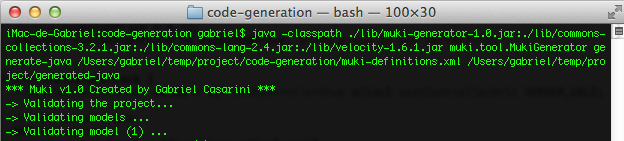
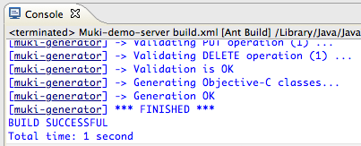

Índice
======
*    1 - <a href="#description">¿Qué es Muki?</a>

1 -¿Qué es Muki?
================
**Muki** es una herramienta que permite generar rápidamente el código que automatiza la comunicación entre los clientes iOS y el servidor JEE a través de un servicio RESTful. A partir de la descripción del servicio, Muki genera clases adicionales en Objective-C que pueden ser fácilmente integradas en las aplicaciones iOS y clases en Java que permiten implementar rápidamente un servicio RESTful siguiendo el estándar [JAX-RS](http://jax-rs-spec.java.net).

Todo el proceso de comunicación por HTTP y la serialización y conversión de datos entre las aplicaciones es realizado automáticamente por las clases generadas. 

Así, con Muki las aplicaciones escritas para iOS pueden fácilmente conectarse con servicios RESTful implementados en Java. El código generado es 100% legible y limpio. Las clases generadas por Muki abstraen la comunicación entre los clientes y el servidor y ocultan los detalles de la comunicación que se realiza en HTTP (métodos GET, POST, PUT y DELETE) y de la serialización de los objetos que viajan en XML y JSON. El siguiente fragmento de código muestra las invocaciones que realiza una aplicación iOS para comunicarse con un servidor remoto, utilizando las clases generadas por Muki.

    // Instanciar el proxy para aceeder al servicio
    CustomerControllerStub  *service = [[CustomerControllerStub alloc] initControllerUrl: @"http://localhost:8080/demo-server/store"];
    
    // Enviar un objeto al servidor
    NSError *error;
    Customer *newCustomer = [[Customer alloc] init];
    newCustomer.name = @"Paul Smith";
    newCustomer.telephone = @"678 900 000";
    [service addCustomer:newCustomer error:&error];
    
    // Recuperar un objeto del servidor
    Customer *anotherCustomer = [service getCustomerId:@"12345667" error:&error];;

2 - Requerimientos para utilizar Muki
=====================================
2.1 - Requerimientos para correr el proceso de generación de clases
-------------------------------------------------------------------
*   Instalación de **Java** (JRE 1.5+)
*   muki-generator-1.0.jar
*   [commons-collections-3.2.1.jar](http://commons.apache.org/collections/), [commons-lang-2.4.jar](http://commons.apache.org/lang/), [velocity-1.6.1.jar](http://velocity.apache.org)
*   Nótese que otras versiones de las librerías posiblemente también funcionen, pero ésas son las versiones que hemos utilizado en nuestras pruebas.

2.2 - Requerimientos del cliente iOS
-------------------------------------------------------------------------
*   Es necesario tener una instalación de Xcode 4.5.x

2.3 - Requerimientos de la aplicación JEE
----------------------------------------------------------------------------
*   Un framework que implemente la especificación [JAX-RS](http://jax-rs-spec.java.net), como [RESTEasy](http://www.jboss.org/resteasy) y otros</li>
*   Opcional: es posible integrar las clases generadas con [Spring Framework<](http://www.springsource.org/spring-framework) y cualquier otro framework. En nuestras pruebas, hemos desplegado el servidor en [Google App Engine](https://developers.google.com/appengine/)utilizando las librerías de RESTEasy v2.0.1.

3 - ¿Cómo se utiliza Muki?
==========================
La creación de un servicio con Muki se resume en 3 pasos:
**PASO 1:** Crear la definición del servicio usando un documento XML. La definición contiene las operaciones que expone el servicio y las estructuras de datos que representan los parámetros y resources.
** PASO 2:** Invocar el proceso de generación, desde Java.
** PASO 3:** Integrar las clases generadas en las aplicaciones.

4 - Definiendo un servicio
==========================
Los servicios creados por Muki comienzan con una descripción de las estructuras de datos y las operaciones para servir las peticiones de los clientes. La descripción del servicio debe estar disponible en un documento XML.

La descripción del servicio tiene 2 partes: por un lado está la definición de los **models**, que son las estructuras de datos que representan los parámetros de entrada y salida (resources); por otro lado están los **controllers** que procesan las peticiones HTTP y sirven los web resources del servicio.

El siguiente fragmento muestra la estructura de definición de un servicio en Muki. El esquema completo del documento XML está disponible en: [muki-service-description-v01.xsd](muki-service-description-v01.xsd).

	<ns2:project name="MukiDemo" xmlns:ns2="http://muki/service-description/">
	    <b><model-definitions ... ></b>
	        <model name="CustomerData">
	            ...
	        </model>
	        ...
	    <b></model-definitions></b>
	    <b><controller-definitions ... ></b>
	        <controller name="CustomerController" ... >
	            <get-operation ... />
	            <post-operation ... />
	            <put-operation ... />
	            <delete-operation ... />
	            ...
	        </controller>
	        ...
	    <b></controller-definitions></b>
	</ns2:project>

4.1 - Definiendo los modelos para representar los resources
-----------------------------------------------------------
En Muki, un **model** es un objeto que representa datos en la aplicación y que se usa enviar y recibir información entre los clientes iOS y el servidor. Un model puede verse como una clase que representan un web resource. Con la descripción de los *models*, Muki genera clases que automatizan el proceso de serializar y deserializar los objetos en formato JSON y XML. Para la serialización en Java, Muki genera las clases de los *models* con anotaciones JAXB. Para la serialización en iOS, Muki genera las clases de los *models* y además clases de soporte en Objective-C.

El siguiente fragmento muestra la definición de los *models*:

    <model-definitions java-package="...">
        <model name="Model1">
            <simple-attr type="..." name="..." />
            <simple-attr type="..." name="..." />
            ...
        </model>
        <model name="Model2">
            <simple-attr type="..." name="..." />
            <list-attr items-type="Model1" name="items" />
            ...
        </model>
        ...
    </model-definitions>

Las definiciones de los *models* van dentro de un elemento **&lt;model-definitions java-package = " ... "&gt;**. El valor del atributo **java-package** es el nombre del paquete donde se generarán las clases Java (beans). Cada model se define con un elemento **&lt;model name = " ... "&gt;**. El valor del atributo **name** es el nombre que se utiliza para generar la correspondiente clase en Java y en Objective-C. Cada model tiene uno o varios atributos, que pueden ser de tipo simple o bien representar listas. Los atributos simples pueden tener tipos básicos (boolean, integer, string, etc) o bien referencias a otro models. Los atributos para listas solo pueden tener referencias a otros models; no es posible tener listas de tipos básicos.

La siguiente tabla muestra los tipos básicos que utiliza Muki y sus correspondencias con tipos de Java y Objective-C cuando se generan las clases.

<table>
    <tr>
        <th align="center"><b>Muki basic type</b></th>
        <th align="center"><b>Java type</b></th>
        <th align="center"><b>Objective-C type</b></th>
    </tr>
    <tr>
        <td align="center">STRING</td>
        <td align="center">String</td>
        <td align="center">NSString</td>
    </tr>
    <tr>
        <td align="center">LONG</td>
        <td align="center">long</td>
        <td align="center">long long</td>
    </tr>
    <tr>
        <td align="center">INT</td>
        <td align="center">int</td>
        <td align="center">NSInteger</td>
    </tr>
    <tr>
        <td align="center">DOUBLE</td>
        <td align="center">double</td>
        <td align="center">double</td>
    </tr>
    <tr>
        <td align="center">BOOLEAN</td>
        <td align="center">boolean</td>
        <td align="center">BOOL</td>
    </tr>
</table>

Tomemos por ejemplo el siguiente diagrama con 2 *models*. Hay un model llamado **TrackData** que tiene atributos de tipos básicos (String, Long, Boolean, etc.) y también hay un model llamado **AlbumData** que tiene 2 atributos de tipo String, una referencia a **TrackData** y un atributo que es una lista de **TrackData**:

El siguiente fragmento corresponde a la descripción que Muki requiere para crear las clases en Java y Objetive-C para el modelo anterior: 

    <model-definitions java-package="demo.model">
        <model name="TrackData">
            <simple-attr type="STRING" name="title" />
            <simple-attr type="INT" name="lengthInSeconds" />
            <simple-attr type="LONG" name="catalogId" />
            <simple-attr type="BOOLEAN" name="newRelease" />
            <simple-attr type="DOUBLE" name="price" />
        </model>
        <model name="AlbumData">
            <simple-attr type="LONG" name="catalogId" />
            <simple-attr type="STRING" name="title" />
            <simple-attr type="STRING" name="artist" />
            <simple-attr type="TrackData" name="mainTrack" />
            <list-attr items-type="TrackData" name="tracks" />
        </model>
    </model-definitions>

Con la definición anterior, Muki genera las siguientes clases en Java. Las clases tienen anotaciones JAXB para la serialización en XML y JSON:

	@XmlRootElement(name = "trackdata")
	@XmlType(name = "TrackData", propOrder = {})
	public class TrackData implements Serializable {
	    private static final long serialVersionUID = 1L;
	    private String title;
	    private int lengthInSeconds;
	    private long catalogId;
	    private boolean newRelease;
	    private double price;

	    @XmlElement(name = "title")
	    public String getTitle() {
	        return this.title;  
	    }
	 
	    public void setTitle(String newValue) {
	        this.title = newValue;  
	    }
	            
	    @XmlAttribute(name = "price")
	    public double getPrice() {
	        return this.price;  
	    }

	    ...
	}

Y también:

	@XmlRootElement(name = "albumdata")
	@XmlType(name = "AlbumData", propOrder = {})
	public class AlbumData implements Serializable {
	    private static final long serialVersionUID = 1L;
	    private long catalogId;
	    private String title;
	    private String artist;
	    private TrackData mainTrack;
	    private List<TrackData> tracks = new ArrayList<TrackData>();

	    @XmlElement(name = "title")
	    public String getTitle() {
	        return this.title;  
	    }
	 
	    @XmlElement(name = "mainTrack")
	    public TrackData getMainTrack() {
	        return this.mainTrack;  
	    }
	 
	    public void setMainTrack(TrackData newValue) {
	        this.mainTrack = newValue;  
	    }
	    
	    @XmlElementWrapper(name = "tracks")
	    @XmlElement(name = "trackdata")
	    public List<TrackData> getTracks() {
	        return this.tracks;  
	    }
	 
	    public void addToTracks(TrackData aValue) {
	        this.tracks .add(aValue);   
	    }
	    
	    public void removeFromTracks(TrackData aValue) {
	        this.tracks .remove(aValue);   
	    }

	    ...
	}

Con la definición anterior, Muki genera las siguientes clases en Objective-C. Nótese que a diferencia de Java, las clases de Objective-C no tienen anotaciones y todo el proceso de serialización en XML y JSON es realizado por clases auxiliares.

	@interface TrackData : NSObject {
	    NSString *title;
	    NSInteger lengthInSeconds;
	    long long catalogId;
	    BOOL newRelease;
	    double price;
	}
	    @property (nonatomic, strong) NSString *title;
	    @property NSInteger lengthInSeconds;
	    @property long long catalogId;
	    @property BOOL newRelease;
	    @property double price;
	    - (id)init;
	@end

Y también:

	@interface AlbumData : NSObject {
	    long long catalogId;
	    NSString *title;
	    NSString *artist;
	    TrackData *mainTrack;
	    NSMutableArray *tracks;
	}
	    @property long long catalogId;
	    @property (nonatomic, strong) NSString *title;
	    @property (nonatomic, strong) NSString *artist;
	    @property (nonatomic, strong) TrackData *mainTrack;
	    @property (nonatomic, strong) NSMutableArray *tracks;
	    - (id)init;
	    - (void)addToTracks: (TrackData *)anObject;
	    - (void)removeFromTracks: (TrackData *)anObject;
	@end

4.2 - Definiendo los controllers con las operaciones del servicio
-----------------------------------------------------------------
Los **controllers** describen las operaciones del servicio que tratan las peticiones para recuperar, agregar, actualizar y borrar web resources del servidor. Con la definición de los **controllers**, Muki genera clases que simplifican la comunicación entre los clientes iOS y el servidor. Así, la comunicación remota se convierte en una simple invocación de métodos entre objetos. Las clases generadas se encargan de establecer la comunicación entre los clientes iOS y el servidor siguiendo los principios RESTful de usar los siguientes métodos definidos en HTTP: **GET**, **POST**, **PUT** y **DELETE**.

El siguiente fragmento muestra la definición de los controllers:

    <controller-definitions java-package="...">
        <controller http-path="..." name="Controller1" >
            <get-operation http-path="..." return-type="..." name="..." serialization-type="...">
                <path-param name="..." />
            </get-operation>
            ...
            <post-operation serialization-type="..." http-path="..." param-type="..." return-type="..." name="..." />
            <put-operation serialization-type="..." http-path="..." param-type="..." name="..." />
            <delete-operation http-path="..." name="...">
                <path-param name="..." />
            </delete-operation>
        </controller>
        <controller http-path="..." name="Controller2" >
            ...
        </controller>
    </controller-definitions>

Como el objetivo es crear un servicio RESTful, las operaciones se mapean directamente a invocaciones con métodos HTTP. Para enviar invocaciones desde iOS, Muki utiliza la definición de los controllers para generar **stubs** que preparan y envían las invocaciones por HTTP.  Para procesar las peticiones en el servidor JEE, Muki usa la definición de los controllers para crear clases con anotaciones que adhieren a la especificación [JAX-RS](http://jax-rs-spec.java.net">JAX-RS).

4.2.1 - Operaciones GET
-----------------------
Las operaciones GET retornan resources. El siguiente fragmento muestra todos los atributos y sub-elementos para definir una operación de GET en Muki.

    <get-operation http-path="/customers/{customerId}/{orderId}" return-type="OrderData" name="getOrder" serialization-type="json">
        <path-param name="customerId" />
        <path-param name="orderId" />
    </get-operation>

La siguiente tabla resume todos los atributos para definir una operación GET en Muki:

<table>
    <tr>
        <th align="center"><b>Atributo</b></th>
        <th align="center"><b>Comentarios</b></th>
    </tr>
    <tr>
        <td align="center">name</td>
        <td>Es el nombre de la operación y debe ser único. En Java, el valor se usa como nombre del método correspondiente en el controller. En Objective-C se usa como primera keyword del método del stub. </td>
    </tr>
    <tr>
        <td align="center">http-path</td>
        <td>Es la ruta para invocar la operación. Puede ser una expresión formada con parámetros. Por ejemplo: "/customers/{id}/{orderId}". Si la ruta contiene parámetros, es necesario declararlos con sub-elementos &lt;path-param ... /&gt; y &lt;query-param ... /&gt;.</td> 
    </tr>
    <tr>
        <td align="center">return-type</td>
        <td>Es el tipo del resultado. El valor puede ser STRING o el nombre de un model.</td>
    </tr>
    <tr>
        <td align="center">serialization-type</td>
        <td>Toma el valor "json" o "xml". Indica el formato para serializar el resource (model) retornado por la operación. Es obligatorio si el valor de return-type es el nombre de un model.</td>
    </tr>
</table>

En el valor de **http-path** se pueden incluir parámetros de tipo **{param}** para que la URI utilizada para invocar la operación sea más flexible. Si se incluyen parámetros, entonces es necesario agregar sub-elementos &lt;path-param name="param1" /&gt; y &lt;query-param name="param2" /&gt; para que Muki pueda contruir los métodos correctamente. Los nombres de los parámetros que aparecen en http-path deben coincidir con los nombres declarados en los sub-elementos. 

Tomemos como ejemplo la siguiente definición de una operación:

    <get-operation http-path="/customers/{customerId}/{orderId}" return-type="OrderData" name="getOrder" serialization-type="json">
        <path-param name="customerId" />
        <path-param name="orderId" />
    </get-operation>

Con la definición anterior, Muki generará el siguiente método en el controller Java:

    @GET
    @Path("/customers/{customerId}/{orderId}")
    @Produces("application/json")
    public OrderData getOrder(@PathParam("customerId") String customerId, @PathParam("orderId") String orderId) {
        OrderData result = this.getDelegate().getOrder(customerId, orderId);
        ...
    }

En la interface del stub en Objective-C, Muki declarará el siguiente método:

	- (OrderData*)getOrderCustomerId: (NSString *)aString1 orderId: (NSString *)aString2 error: (NSError **)error;    

4.2.2 - Operaciones PUT y POST
------------------------------
En general, las operaciones de POST se usan para agregar recursos nuevos y las operaciones de PUT para actualizar las propiedades de recursos ya existentes en el servidor. El siguiente fragmento muestra todos los atributos y sub-elementos para definir operaciones de POST y PUT en Muki. Su estructura es similar.

    <post-operation http-path="/customers/{customerId}/{orderId}" param-type="OrderData" return-type="OrderData" name="addOrder" serialization-type="json">
        <path-param name="customerId" />
        <path-param name="orderId" />
    </post-operation>

    <put-operation http-path="/customers/{customerId}/{orderId}" param-type="OrderData" return-type="OrderData" name="updateOrder" serialization-type="json">
        <path-param name="customerId" />
        <path-param name="orderId" />
    </put-operation>

La siguiente tabla resume todos los atributos para definir una operación POST/PUT en Muki:

<table>
    <tr>
        <th align="center"><b>Atributo</b></th>
        <th align="center"><b>Comentarios</b></th>
    </tr>
    <tr>
        <td align="center">name</td>
        <td>Es el nombre de la operación y debe ser único. En Java, el valor se usa como nombre del método correspondiente en el controller. En Objective-C se usa como primera keyword del método del stub. </td>
    </tr>
    <tr>
        <td align="center">http-path</td>
        <td>Es la ruta para invocar la operación. Puede ser una expresión formada con parámetros. Por ejemplo: "/customers/{id}/{orderId}". Si la ruta contiene parámetros, es necesario declararlos con sub-elementos &lt;path-param ... /&gt; y &lt;query-param ... /&gt;.</td> 
    </tr>
    <tr>
        <td align="center">param-type</td>
        <td>En las operaciones de PUT y POST es posible enviar un objeto (model) como parámetro de entrada. El valor de param-type indica el tipo del parámetro y puede ser STRING o el nombre de un model. Si este atributo no está definido, significa que la operación no tiene parámetro de entrada.</td>
    </tr>
    <tr>
        <td align="center">return-type</td>
        <td>Es el tipo del resultado. El valor puede ser STRING o el nombre de un model. Si este atributo no está definido, significa que la operación no retorna resultado.</td>
    </tr>
    <tr>
        <td align="center">serialization-type</td>
        <td>Toma el valor "json" o "xml". Indica el formato para serializar el parámetro de entrada y el resultado retornado por la operación.</td>
    </tr>
</table>

En el valor de **http-path** se pueden incluir parámetros de tipo **{param}** para que la URI utilizada para invocar la operación sea más flexible. Ver la explicación para la declaración de operaciones GET.

Tomemos como ejemplo la siguiente definición de una operación POST y otra PUT:

	<post-operation http-path="/customers/{customerId}/{orderId}" param-type="OrderData" return-type="OrderData" name="addOrder" serialization-type="json">
	        <path-param name="customerId" />
	        <path-param name="orderId" />
	    </post-operation>

Y también:

    <put-operation http-path="/customers/{customerId}/{orderId}" param-type="OrderData" return-type="OrderData" name="updateOrder" serialization-type="json">
        <path-param name="customerId" />
        <path-param name="orderId" />
    </put-operation>

Con la definición anterior, Muki generará los siguientes métodos en el controller Java:

    @POST
    @Path("/customers/{customerId}/{orderId}")
    @Consumes("application/json")
    @Produces("application/json")
    public OrderData addOrder(@PathParam("customerId") String customerId, @PathParam("orderId") String orderId, OrderData param) {
        return this.getDelegate().addOrder(customerId, orderId, param);
    }

    @PUT
    @Path("/customers/{customerId}/{orderId}")
    @Consumes("application/json")
    @Produces("application/json")
    public OrderData updateOrder(@PathParam("customerId") String customerId, @PathParam("orderId") String orderId, OrderData param) {
        return this.getDelegate().updateOrder(customerId, orderId, param);
    }

En la interface del stub en Objective-C, Muki declarará los siguientes métodos:

	- (OrderData*)addOrder: (OrderData *)anObject customerId: (NSString *)aString2 orderId: (NSString *)aString3 error: (NSError **)error;    
	- (OrderData*)updateOrder: (OrderData *)anObject customerId: (NSString *)aString2 orderId: (NSString *)aString3 error: (NSError **)error;    

4.2.3 - Operaciones DELETE
--------------------------
Las operaciones de DELETE permiten borrar recursos del servidor. El siguiente fragmento muestra todos los atributos y sub-elementos para definir operaciones de DELETE en Muki:

    <delete-operation http-path="/customers/{customerId}/{orderId}" name="deleteOrder">
        <path-param name="customerId" />
        <path-param name="orderId" />
    </delete-operation>

La siguiente tabla resume todos los atributos para definir una operación DELETE en Muki:

<table>
    <tr>
        <th align="center"><b>Atributo</b></th>
        <th align="center"><b>Comentarios</b></th>
    </tr>
    <tr>
        <td align="center">name</td>
        <td>Es el nombre de la operación y debe ser único. En Java, el valor se usa como nombre del método correspondiente en el controller. En Objective-C se usa como primera keyword del método del stub. </td>
    </tr>
    <tr>
        <td align="center">http-path</td>
        <td>Es la ruta para invocar la operación. Puede ser una expresión formada con parámetros. Por ejemplo: "/customers/{id}/{orderId}". Si la ruta contiene parámetros, es necesario declararlos con sub-elementos &lt;path-param ... /&gt; y &lt;query-param ... /&gt;.</td> 
    </tr>
</table>

En el valor de **http-path** se pueden incluir parámetros de tipo **{param}** para que la URI utilizada para invocar la operación sea más flexible. Ver la explicación para la declaración de operaciones GET.

Tomemos como ejemplo la siguiente definición de una operación DELETE:

    <delete-operation http-path="/customers/{customerId}/{orderId}" name="deleteOrder">
        <path-param name="customerId" />
        <path-param name="orderId" />
    </delete-operation>

Con la definición anterior, Muki generará el siguiente método en el controller Java:

    @DELETE
    @Path("/customers/{customerId}/{orderId}")
    public void deleteOrder(@PathParam("customerId") String customerId, @PathParam("orderId") String orderId) {
        this.getDelegate().deleteOrder(customerId, orderId);
    }

En la interface del stub en Objective-C, Muki declarará el siguiente método:

	- (void)deleteOrderCustomerId: (NSString *)aString1 orderId: (NSString *)aString2 error: (NSError **)error;    

5 - Invocando la generación de código
=====================================
El proceso de generación de las clases Java y Objective-C es un programa escrito en Java y se puede invocar desde una consola de comandos o bien desde un script de Ant. En ambos casos, además de la librería de Muki (muki-generator-1.0.jar), es necesario agregar al classpath las siguientes librerías: **commons-collections-3.2.1.jar**, **commons-lang-2.4.jar**, **velocity-1.6.1.jar**. Nótese que posiblemente otras versiones de las librerías también funcionen. 

Es necesario hacer una invocación para generar las clases Java y otra para generar las clases Objective-C.

Cuando invocamos el proceso de generación, Muki evalúa la definición del servicio (XML). Si la definición no tiene errores, Muki genera las clases en el directorio de salida. Si la definición tiene errores, Muki lista los problemas encontrados. En este caso, debemos corregir los errores y volver a invocar el proceso de generación.

5.1 - Por línea de comandos
---------------------------
La sintaxis es: **muki.tool.MukiGenerator &lt;option&gt; &lt;path-to-definition.xml&gt; &lt;output-directory&gt;**

donde:

*    **&lt;option&gt;**:  debe ser **generate-java** o **generate-objc**, para indicar si Muki genera las clases del servidor Java o del cliente Cocoa, respectivamente.
*    **&lt;path-to-definition.xml&gt;**: la ruta completa al fichero XML que tiene la definición del servicio
*    **&lt;output-directory&gt;**: ruta completa del directorio donde Muki genera las clases. El directorio debe existir.

Ejemplo de una invocación para generar las clases en Java:

	>java -classpath ./lib/muki-generator-1.0.jar:./lib/commons-collections-3.2.1.jar:./lib/commons-lang-2.4.jar:./lib/velocity-1.6.1.jar <b>muki.tool.MukiGenerator</b> <b>generate-java</b> /Users/gabriel/temp/project/code-generation/muki-definitions.xml /Users/gabriel/temp/project/generated-java

5.2 - Por un script de Ant
--------------------------

    <target name="generate-java-server">
      <path id="tools.classpath">
        <fileset dir="${basedir}/lib">
          <include name="*.jar" />
        </fileset>
      </path>
      <taskdef name="muki-generator" classpathref="tools.classpath" classname="muki.tool.AntTask"/>
      <mkdir dir="${server.generation.dir}"/>
      <muki-generator 
        option="generate-java" 
        projectFile="${basedir}/muki-definitions.xml" 
        outputDirectory="${server.generation.dir}" />
    </target>

6 - Integrando las clases generadas en la aplicación
====================================================
Es importante señalar que ninguna de las clases generadas por Muki debe modificarse manualmente. Si se requieren cambios, hay que modificar la definición del servicio (XML) y volver a lanzar el proceso de generación.

El siguiente diagrama muestra la secuencia de invocaciones para obtener recursos del servidor. La aplicación iOS invoca un método de stub generado por Muki en Objective-C. El stub se encarga de procesar la llamada y enviar la petición HTTP (GET) al servidor. La petición HTTP llega al servidor, es procesada y se convierte en la invocación del método de la clase del controller generado por Muki en Java. El controller a su vez invoca al delegate que implementa la funcionalidad del servicio. El delegate implementa una interface Java también generada por Muki.

6.1 - Código generado para integrar en la aplicación JEE (servidor)
-------------------------------------------------------------------
La siguiente tabla resume las clases que Muki genera para la aplicación en Java (servidor), cuando se invoca el proceso de generación con la opción <code>**generate-java**</code>:

<table>
    <tr>
        <th align="center"><b>Clase / Interface</b></th>
        <th align="center"><b>Comentarios</b></th>
    </tr>
    <tr>
        <td align="center">RestApplication</td>
        <td>Es la clase que gestiona la integración con Resteasy. Retorna la instancia del servicio que atenderá las peticiones. Esta clase no debe modificarse!</td>
    </tr>
    <tr>
        <td align="center">Model</td>
        <td>Por cada definición de <b>&lt;model ... &gt;</b>, Muki genera una clase con anotaciones JAXB para la serialización en XML y JSON. Estas clases son los beans de datos que viajan entre los clientes iOS y el servidor. Estas clases no deben modificarse!</td> 
    </tr>
    <tr>
        <td align="center">Controllers</td>
        <td>Por cada definición de <b>&lt;controller ... &gt;</b>, Muki genera una clase con anotaciones JAX-RS. Estos controllers reciben y procesan las peticiones HTTP enviadas por los clientes. Los controllers tienen métodos para las operaciones declaradas en los elementos: <b>&lt;get-operation ... &gt;</b>, <b>&lt;post-operation ... &gt;</b>, <b>&lt;put-operation ... &gt;</b> y <b>&lt;delete-operation ... &gt;</b>. Los controllers invocan a otras clases llamadas <b>Delegated</b>. Allí es donde se implementa la lógica del servicio. Las clases de los controllers no deben modificarse!</td> 
    </tr>
    <tr>
        <td align="center">ControllerDelegates</td>
        <td>Estas interfaces contienen todas las operaciones que de los controllers del servicio. El desarrollador debe implementar estas interfaces con el comportamiento concreto del servicio y además integrar los delegates en los controllers. Cuando llega una petición a un controller, éste invoca al delegate que tiene asociado. Muki genera una interface de delegate para cada controller. La definición de los delegates no debe modificarse!</td> 
    </tr>
    <tr>
        <td align="center">MukiExceptionMapper</td>
        <td>Es una clase de soporte que implementa un mapper para gestionar las excepciones que se lanzan cuando un recurso no se encuentra en el servidor. Esta clase no debe modificarse!</td> 
    </tr>
    <tr>
        <td align="center">MukiResourceNotFoundException</td>
        <td>Es la clase de soporte para modelar las excepciones que se lanzan cuando un recurso no se encuentra en el servidor. Esta clase no debe modificarse!</td> 
    </tr>
</table>

6.2 - Código generado para iOS (clientes)
-----------------------------------------
La siguiente tabla resume las clases que Muki genera para la aplicación en iOS (clientes), cuando se invoca el proceso de generación con la opción <code>**generate-objc**</code>:

<table>
    <tr>
        <th align="center"><b>Clase / Interface</b></th>
        <th align="center"><b>Comentarios</b></th>
    </tr>
    <tr>
        <td align="center">Model</td>
        <td>Por cada definición de <b>&lt;model ... &gt;</b>, Muki genera una clase que representa los resources y objetos que viajan entre los clientes iOS y el servidor. Estos objetos son serializados en XML y JSON.</td>
    </tr>
    <tr>
        <td align="center">Model parser delegates</td>
        <td>Clases auxiliares que gestionan la serialización en XML. Se genera un delegate para cada model. Estas clases implementan el protocolo <a href="http://developer.apple.com/library/ios/#documentation/cocoa/reference/NSXMLParserDelegate_Protocol/Reference/Reference.html">
NSXMLParserDelegate</a></td>
    </tr>
    <tr>
        <td align="center">MukiControllerStub</td>
        <td>Es la superclase de todos los stubs. Implementa la funcionalidad para comunicarse con el servidor remoto</td>
    </tr>
    <tr>
        <td align="center">Controller Stubs</td>
        <td>Representan a los controllers, del lado de los clientes iOS. Las aplicaciones invocan las operaciones de los stubs y éstos codifican y envían las peticiiones HTTP a los controllers del servidor. Muki crea un stub para cada controller del servidor</td>
    </tr>
    <tr>
        <td align="center">XmlSerializer XmlAttribute ObjectParserDelegate</td>
        <td>Clases auxiliares usadas para serializar en XML</td>
    </tr>
    <tr>
        <td align="center">JsonSerializer  JsonDeserializer</td>
        <td>Para manejar la serializacion desde JSON. Se basa en el framework <a href="http://stig.github.com/json-framework/">SBJson</a></td>
    </tr>
    <tr>
        <td align="center">NSDataBase64</td>
        <td>Implementa una extensión de NSData que permite codificar y decodificar en Base64.
La implementación original es de <a href="http://cocoawithlove.com/2009/06/base64-encoding-options-on-mac-and.html">Matt Gallagher (Cocoa with love)</a></td>
    </tr>
    <tr>
        <td align="center">Clases de SBJson</td>
        <td>Se incluye el fuente de las clases del framework <a href="http://stig.github.com/json-framework/">SBJson</a> (no es una librería!)</td>
    </tr>
</table>

6.3 - Pasos para integrar las clases generadas en la aplicación cliente (iOS)
-----------------------------------------------------------------------------
En general todas las clases generadas son compatibles con el esquema [ARC (Automatic Reference Counting)](http://developer.apple.com/library/ios/#releasenotes/ObjectiveC/RN-TransitioningToARC/Introduction/Introduction.html) de gestión de memoria. La única excepción son las clases de los <b>*ParserDelegate.m</b>, que no soportan ARC y utilizan el modelo convencional e incluyen *[... autorelease]*.

Esto significa que es necesario hacer algunas adaptaciones de forma manual para que las clases generadas funcionen correctamente.

**PASO 1)** En el proyecto (Xcode) para la aplicación, usar el modelo ARC de gestión de memoria

**PASO 2)** Agregar todas las clases generadas en el proyecto, con la opción **Add Files to ...**

**PASO 3)** Indicar que las clases generadas cuyo nombre es <b>*ParserDelegate.m</b> no utilizan ARC (Ej: CdParserDelegate.m).  Para hacerlo, ir al target del proyecto, ir a las **Build phases** y agregar un flag de compilación: <code>-fno-objc-arc</code>

**PASO 4)** Compilar. No deberían aparecer errores de compilación.

**PASO 5)** En la aplicación, agregar instanciar los stubs y models para hacer las invocaciones al servicio. Por ejemplo:

    TrackData *newTrack = [[TrackData alloc] init];
    newTrack.title = @"New track";
    newTrack.lengthInSeconds = 247;
    newTrack.price = 1.25;
    newTrack.newRelease = YES;
    newTrack.catalogId = 0;
    
    TrackControllerStub  *stub = [[TrackControllerStub alloc] initControllerUrl: @"http://localhost:8080/demo-server/store"];
    NSError *error;
    TrackData *addedTrack = [stub addTrack:newTrack error:&error];

    TrackData *myTrack = [stub getTrackId:@"3" error:&error];

Nótese que ***error** es un parámetro de salida enviado por referencia para que podamos consultar si se ha producido un error en la invocación. Es forma la correcta de gestionar los errores en Cocoa. [Ver más detalles](https://developer.apple.com/library/mac/#documentation/Cocoa/Conceptual/ErrorHandlingCocoa/CreateCustomizeNSError/CreateCustomizeNSError.html").

6.4 - Pasos para integrar las clases generadas en la aplicación del servidor (JEE)
----------------------------------------------------------------------------------

**PASO 1)** Agregar a la aplicación las librerías un framework que implemente la especificación [JAX-RS](http://jax-rs-spec.java.net), como [RESTEasy](http://www.jboss.org/resteasy) y otros.

**PASO 2)** Agregar a la aplicación las clases Java que generó Muki

**PASO 3)** Crear la clase para implementar las interfaces <b>*Delegate</b>. Estas interfaces tienen todos los métodos de los controllers del servicio

**PASO 4)** Integrar las clases que implementan las interfaces <b>*Delegate</b> con los **controllers**. Esto puede hacerse directamente instanciando las clases desde los controllers, pero en una aplicación basada en [Spring Framework](http://www.springsource.org/spring-framework) es más recomendable usar la [inyección de dependencias](http://static.springsource.org/spring/docs/3.2.x/spring-framework-reference/html/beans.html).

**PASO 5)** Declarar el nombre completo de la clase **MukiExceptionMapper** como parámetro en el fichero **web.xml** de la aplicación. El nombre del parámetro depende de la implementación de JAX-RS que usemos. En el caso de Resteasy, la declaración sería la siguiente:

	<context-param>
	   <param-name>resteasy.providers</param-name>
	   <param-value>package.name.MukiExceptionMapper</param-value>        
	</context-param>

7 - Un ejemplo completo
=======================
Hemos construído un ejemplo completo para mostrar cómo Muki genera las clases para que un cliente iOS se conecte con un servicio RESTful implementado en JEE.

El servicio utiliza la implementación JAX-RS de [Resteasy](http://www.jboss.org/resteasy/) y también usa [Spring Framework](http://www.springsource.org/spring-framework) para la inyeccción de las dependencias.

Para ver el ejemplo, hay que descargar el fichero zip, descomprimirlo y seguir las instrucciones del fichero demo_muki.html que viene adentro. El ejemplo ya incluye todas las librerías necesarias para ponerlo en marcha rápidamente!

